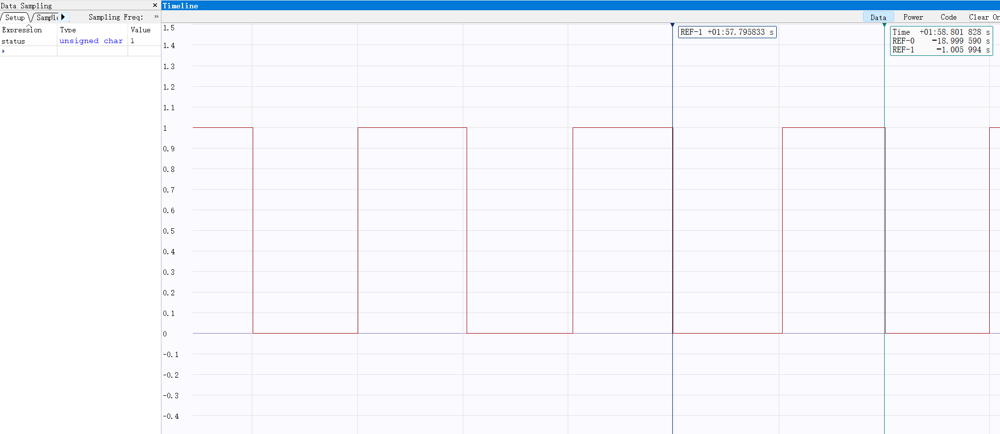
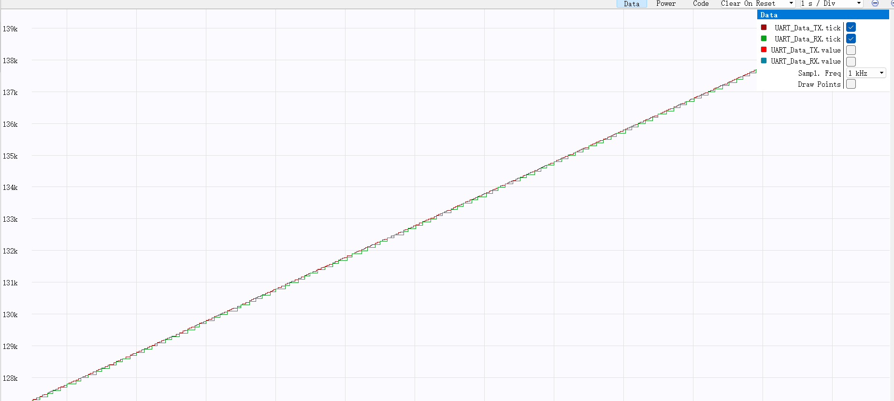
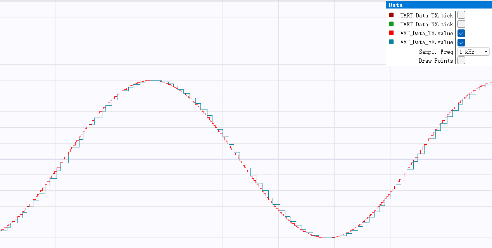

# HW2026电控组第⼀次培训作业  

## 说明

工程文件夹放在`./project`，周结和效果照片、视频放在`./doc`

## 点亮LED

配置定时器2周期为1kHz，预分配系数72-1，重装载值1000-1

```  cpp
htim2.Init.Prescaler = 72 - 1;
htim2.Init.Period = 1000 - 1;
```

启动定时器2并开启中断

```cpp
HAL_TIM_Base_Start_IT(&htim2);
```

重写定时器中断回调函数

```cpp
void HAL_TIM_PeriodElapsedCallback(TIM_HandleTypeDef *htim) {
  if (htim == &htim2) {
    MainTask();
  }
}
```

在`MainTask`加入

```cpp
LED_cnt++;
if (LED_cnt >= 500) { /*LED以1Hz闪烁*/
    LED_cnt = 0;
    HAL_GPIO_TogglePin(GPIOC, GPIO_PIN_13);
    LED_status = HAL_GPIO_ReadPin(GPIOC, GPIO_PIN_13);}
```

效果：
视频在`./doc/video/LED闪烁.mp4`下

Ozone用光标测量频率约1Hz



## 串⼝收发

### tick记录运行时间

定义全局变量tick之后，在`Maintask()`加入

```cpp
tick++;
```

### 串口通讯

#### 通讯协议

```cpp
typedef struct {
  uint32_t tick;
  float value;
} UartCommData;

UartCommData UART_Data_TX = {0, 0};
UartCommData UART_Data_RX = {0, 0};
```

#### 更新数据

在`Maintask()`加入

```cpp
UART_Data_TX.tick = tick;
UART_Data_TX.value =
  sin(UART_Data_TX.tick / 1000.0); /*UART_Data_TX以1kHz更新*/
```

#### 编解码

##### `encode()`

```cpp
void encode(UartCommData *data, uint8_t *buffer) {
  buffer[0] = 0xAA;
  buffer[1] = 0xBB;
  buffer[2] = 0xCC;

  buffer[3] = (data->tick >> 24) & 0xFF; /*取24-31位*/
  buffer[4] = (data->tick >> 16) & 0xFF;
  buffer[5] = (data->tick >> 8) & 0xFF;
  buffer[6] = (data->tick >> 0) & 0xFF;

  float clamped_value = fmaxf(-1.0f, fminf(1.0f, data->value));
  int16_t val_scaled = (int16_t)(clamped_value * 30000.0f);

  buffer[7] = (val_scaled >> 8) & 0xFF;
  buffer[8] = (val_scaled >> 0) & 0xFF;
}
```

##### `decode()`

```cpp
void decode(uint8_t *frame, UartCommData *data) {
  data->tick = ((uint32_t)frame[3] << 24) | ((uint32_t)frame[4] << 16) |
               ((uint32_t)frame[5] << 8) | ((uint32_t)frame[6]);

  int16_t val_scaled = (int16_t)((frame[7] << 8) | frame[8]);
  data->value = (float)val_scaled / 30000.0f;
}
```

#### 发送

以10Hz发送

```cpp
UART_cnt_TX++;
if (UART_cnt_TX >= 100) /*UART1以10Hz发送*/
{
    UART_cnt_TX = 0;
    encode(&UART_Data_TX, UART_buf_TX);
    HAL_UART_Transmit(&huart1, UART_buf_TX, 9, 1);
}
```

#### 接收

使用DMA空闲接收  

##### 状态机

```cpp
// DMA 接收缓冲
uint8_t rx_temp_buf[32];

// 用于解析 rx_temp_buf的状态机
typedef enum {
  RX_STATE_IDLE,
  RX_STATE_WAIT_BB,
  RX_STATE_WAIT_CC,
  RX_STATE_RECEIVING
} RxState;

RxState rx_state = RX_STATE_IDLE;
uint8_t rx_index = 0;
```

##### 解析数据

```cpp
void ParseUARTFrame(uint8_t *data, uint16_t size) {
  for (int i = 0; i < size; i++) {
    uint8_t byte = data[i];

    switch (rx_state) {
    case RX_STATE_IDLE:
      if (byte == 0xAA) {
        UART_buf_RX[0] = byte;
        rx_index = 1;
        rx_state = RX_STATE_WAIT_BB;
      }
      // 其他字节直接忽略
      break;

    case RX_STATE_WAIT_BB:
      if (byte == 0xBB) {
        UART_buf_RX[1] = byte;
        rx_index = 2;
        rx_state = RX_STATE_WAIT_CC;
      } else {
        if (byte == 0xAA) {
          UART_buf_RX[0] = byte;
          rx_index = 1;
          rx_state = RX_STATE_WAIT_BB;
        } else {
          rx_state = RX_STATE_IDLE;
        }
      }
      break;

    case RX_STATE_WAIT_CC:
      if (byte == 0xCC) {
        UART_buf_RX[2] = byte;
        rx_index = 3;
        rx_state = RX_STATE_RECEIVING;
      } else {
        if (byte == 0xAA) {
          UART_buf_RX[0] = byte;
          rx_index = 1;
          rx_state = RX_STATE_WAIT_BB;
        } else {
          rx_state = RX_STATE_IDLE;
        }
      }
      break;

    case RX_STATE_RECEIVING:
      UART_buf_RX[rx_index++] = byte;
      if (rx_index >= 9) {
        decode(UART_buf_RX, &UART_Data_RX);
        rx_state = RX_STATE_IDLE;
        rx_index = 0;
      }
      break;
    }
  }
}
```

##### 开启DMA空闲接收

```cpp
HAL_UARTEx_ReceiveToIdle_DMA(&huart2, rx_temp_buf, 32);
```

##### DMA空闲回调

```cpp
// DMA 接收缓冲
uint8_t rx_temp_buf[32];

// 当检测到串口总线空闲时调用（一帧数据结束）
void HAL_UARTEx_RxEventCallback(UART_HandleTypeDef *huart, uint16_t Size) {
  if (huart == &huart2) {
    // 将接收到的数据交给状态机处理
    ParseUARTFrame(rx_temp_buf, Size);
    // 重新启动接收
    HAL_UARTEx_ReceiveToIdle_DMA(&huart2, rx_temp_buf, sizeof(rx_temp_buf));
  }
}
```

##### 效果展示

###### tick



###### value

###### 

## CAN收发  

### 初始化

在`MainInit()`加入

```cpp
CanFilter_Init(&hcan);
if (HAL_CAN_Start(&hcan) != HAL_OK) {
	Error_Handler(); 
}
HAL_CAN_ActivateNotification(&hcan, CAN_IT_RX_FIFO0_MSG_PENDING);
```

### 帧格式

一帧8字节

- 字节0-3：tick的高->低位(Big endian)
- 字节4-5：value1变换后的值
- 字节6：value2的值
- 字节7
    - 低四位：flag1-flag4
    - 高四位：保留

```cpp
struct CANCommData{
  uint32_t tick;
  float value1;
  uint8_t value2;
  bool flag1;
  bool flag2;
  bool flag3;
  bool flag4;
} ;
CANCommData CAN_Data_TX = {0, 0.0f, 0, false, false, false, false};
CANCommData CAN_Data_RX = {1, 0.0f, 0, false, false, false, false};
```


### 发送

#### 编码

```cpp
void CAN_TxPack(CANCommData *data, uint8_t *tx_data) {
  // byte 0~3: tick (uint32_t) 大端
  tx_data[0] = (data->tick >> 24) & 0xFF;
  tx_data[1] = (data->tick >> 16) & 0xFF;
  tx_data[2] = (data->tick >> 8) & 0xFF;
  tx_data[3] = data->tick & 0xFF;

  // byte 4~5: value1 (float) 缩放为 int16_t
  int16_t val1_scaled =
      (int16_t)(fmaxf(-1.0f, fminf(1.0f, data->value1)) * 30000.0f);
  tx_data[4] = (val1_scaled >> 8) & 0xFF;
  tx_data[5] = val1_scaled & 0xFF;

  // byte 6: value2 (uint8_t) 
  tx_data[6] = data->value2 & 0xFF;

  // byte 7: flag1~flag4 打包到低4位
  tx_data[7] = 0;
  tx_data[7] |= (data->flag1 ? 1 : 0) << 0;
  tx_data[7] |= (data->flag2 ? 1 : 0) << 1;
  tx_data[7] |= (data->flag3 ? 1 : 0) << 2;
  tx_data[7] |= (data->flag4 ? 1 : 0) << 3;
  // 高4位保留为0
}
```

#### 发送

在`MainTask()`加入

```cpp
CAN_cnt_TX++;
if (CAN_cnt_TX >= 100) {
    CAN_cnt_TX = 0;
    CAN_Data_TX.tick = UART_Data_TX.tick;
    CAN_Data_TX.value1 = UART_Data_TX.value;
    CAN_TxPack(&CAN_Data_TX, CAN_buf_TX);
    CAN_Send_Msg(&hcan, CAN_buf_TX, 0x100, 8);
}
```

### 接收

#### 解码

```cpp
void CAN_RxUnpack(uint8_t *rx_data, CANCommData *data) {
  // byte 0~3: tick
  data->tick = ((uint32_t)rx_data[0] << 24) | ((uint32_t)rx_data[1] << 16) |
               ((uint32_t)rx_data[2] << 8) | rx_data[3];

  // byte 4~5: value1
  int16_t val1_scaled = (int16_t)((rx_data[4] << 8) | rx_data[5]);
  data->value1 = (float)val1_scaled / 30000.0f;

  // byte 6: value2
  data->value2 = rx_data[6];

  // byte 7: flags
  data->flag1 = (rx_data[7] >> 0) & 0x1;
  data->flag2 = (rx_data[7] >> 1) & 0x1;
  data->flag3 = (rx_data[7] >> 2) & 0x1;
  data->flag4 = (rx_data[7] >> 3) & 0x1;
}
```

#### 接收

修改回调函数

```cpp
void HAL_CAN_RxFifo0MsgPendingCallback(CAN_HandleTypeDef *hcan) {

  if (HAL_CAN_GetRxMessage(hcan, CAN_RX_FIFO0, &rx_header, can_rx_data) ==
      HAL_OK) // 获得接收到的数据头和数据
  {
    if (rx_header.StdId == 0x100) {
      // 帧头校验
      CAN_RxUnpack(can_rx_data, &CAN_Data_RX);
    }
  }
  HAL_CAN_ActivateNotification(
      hcan, CAN_IT_RX_FIFO0_MSG_PENDING); // 再次使能FIFO0接收中断
}
```

#### 效果

##### tick


##### value


#### 问题

弄了半天一直没收到，后来在`CAN_Send_Msg`中加入返回值的检查，打断点调试发现卡在了这里↓

```cpp
if (HAL_CAN_AddTxMessage(hcan, &TxMessageHeader, msg, &pTxMailbox) !=
      HAL_OK) {
    Error_Handler();
  }
```

后来修改CAN参数才成功
